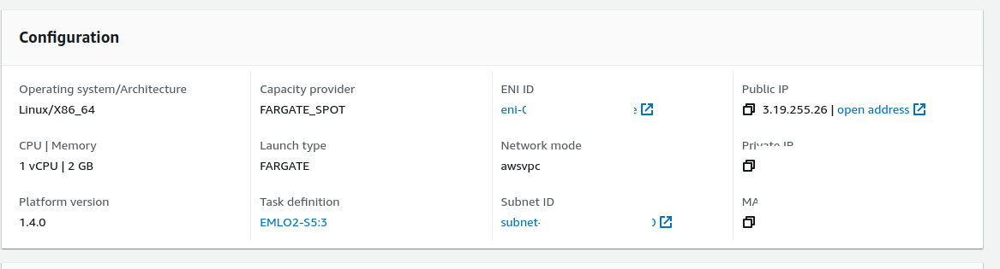
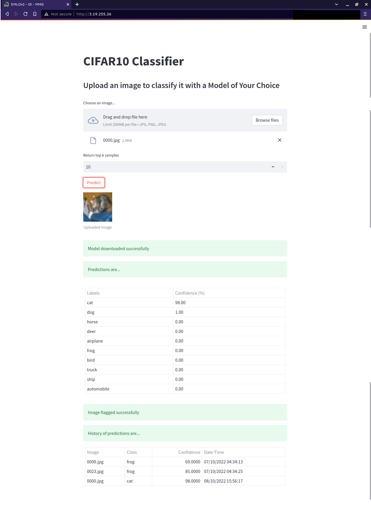

# EMLO Session 5

Tasks:
- [x] Streamlit app should download from S3 bucket
- [x] Deploy app on Fargate (Spot Instances)
- [x] (BONUS) Perform Flagging (i.e. log I/O and date/time)

## Using S3 to Download Model
We read from an environment variable (required for the bonus part) the path for the model. This path is customizable.

```python
MODEL_PATH = os.getenv('model', 's3://emlov2-s5/model.trace.pt')
```

## (Bonus) Logging Inferences
To log all inferences (aka flagging), we specify the path as an environment variable (required for the bonus part) 

```python
FLAGGED_DIR = os.getenv('flagged_dir', 's3://emlov2-s5/outputs')
```

The history will be displayed on the streamlit page (shown below).

## Deploying on Fargate

Main steps:
- Create IAM Role for `Elastic Container Service Task`; Give it the `AmazonEC2ContainerRegistryReadOnly` and `AmazonS3FullAccess`
- Create a Security Group; Allow port 80 as the Inbound Rule
- Create ECS Cluster (Name: EMLOv2-S5)
- Create ECS Task Definition (Name: EMLO2-S5)
	- Assign the IAM Role above
- Got to the cluster created. In the `Services` tab, choose `Deploy`
	- In the `Networking` tab, choose the Security Group created above.
- In the Service tab of the Cluster, go to `Configuration and tasks`. Choose the running task, and copy its Public IP. 

- Enter in the URL bar to view the page.



